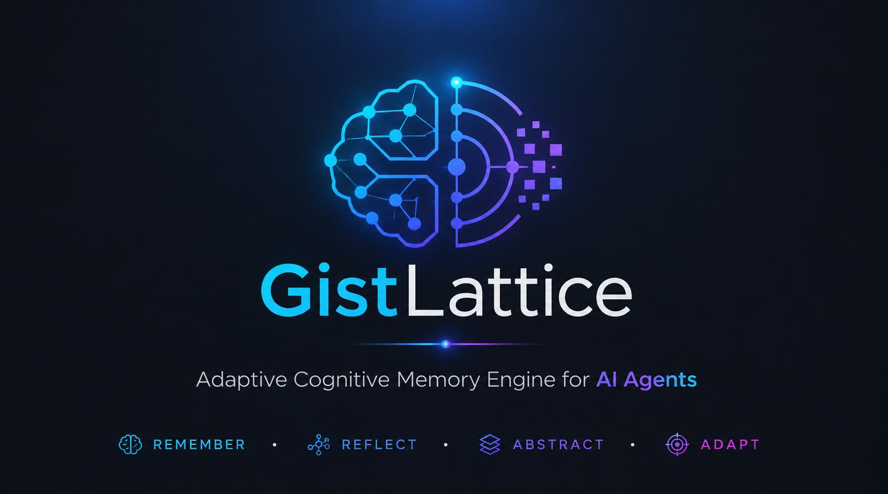
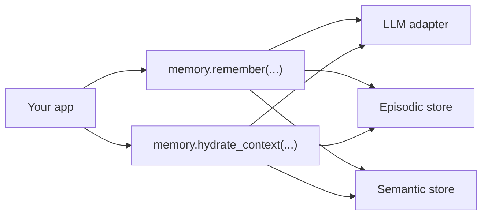

# GistLattice



GistLattice is a compact memory layer for agents and long-lived Python apps.

It gives you a clean way to:

- retrieve relevant episodic memories
- hydrate prompts with durable semantic context
- consolidate interactions back into memory
- swap storage backends without rewriting your app logic

It is intentionally core-first and Python-native. You can use it directly in an agent loop, wrap it in your own service, or grow it into a larger system later.

Tags: agent memory, LLM, prompt hydration, episodic memory, semantic memory, memory consolidation, Qdrant, Neo4j, Redis, OpenAI, Gemini, Ollama, Anthropic

## Why It Matters

Most agent stacks remember only the current prompt. GistLattice adds a structured memory loop:

1. look up relevant memories
2. inject context into the next prompt
3. analyze the interaction
4. write the result back into episodic and semantic memory

That gives your app a practical path from stateless chat to durable, tenant-aware memory.

## What You Get

- `retrieve(...)` for memory lookup
- `hydrate_context(...)` for prompt-ready memory text
- `build_hydrated_prompt(...)` for both the prompt block and structured gists
- `queue_consolidation(...)` for deferred memory writes
- `consolidate(...)` for turning a prompt/response pair into memory
- pluggable backends for episodic, semantic, and queue storage
- provider-agnostic LLM adapters, plus ready-made helpers for OpenAI, Gemini, Ollama, and Anthropic

## Install

Base install:

```bash
pip install gistlattice
```

Optional backend extras:

```bash
pip install gistlattice[qdrant]
pip install gistlattice[neo4j]
pip install gistlattice[redis]
```

Optional provider extras:

```bash
pip install gistlattice[openai]
pip install gistlattice[gemini]
pip install gistlattice[ollama]
pip install gistlattice[anthropic]
```

## Quick Start

The easiest way to get started is using the high-level `GistLattice` client with a provider like OpenAI. Make sure you have the `openai` extra installed and your `OPENAI_API_KEY` set.

```python
import asyncio
from gistlattice import GistLattice

async def main() -> None:
    # 1. Initialize the client (defaults to in-memory storage)
    memory = GistLattice(provider="openai", tenant_id="tenant-a", user_id="user-a")

    # 2. Store an interaction synchronously
    analysis = await memory.remember(
        prompt="Help me plan my next task.",
        response="Here is a memory-bearing response from your own app."
    )
    print(f"Saved Memory Gist: {analysis.gist}")

    # 3. Retrieve formatted context to inject into your next LLM prompt
    context = await memory.hydrate_context("What should I do next?")
    print("\n--- Hydrated Context ---")
    print(context)

asyncio.run(main())
```

## Typical Flow



## Configuration

`Settings` can be created directly in Python or loaded from the environment.

Core settings:

- `GISTLATTICE_LLM_FACTORY_PATH`, `Settings.llm_factory`, or `Settings.llm_provider` is required
- `Settings.llm_provider` selects the provider for analysis and response synthesis
- `Settings.embedding_provider` can be set independently when you want a different provider for embeddings
- `GISTLATTICE_EPISODIC_BACKEND` defaults to `memory`
- `GISTLATTICE_SEMANTIC_BACKEND` defaults to `memory`
- `GISTLATTICE_QUEUE_BACKEND` defaults to `memory`
- `GISTLATTICE_MEMORY_LIMIT` defaults to `3`

Provider and backend docs:

- [Getting Started](./docs/getting-started.md)
- [Configuration](./docs/configuration.md)
- [Backends](./docs/backends.md)
- [Provider Adapters](./docs/providers.md)

If you use Qdrant, you can optionally set `GISTLATTICE_QDRANT_VECTOR_SIZE`. If you do not set it, GistLattice will create the collection from the first embedding it stores.

## Provider Helpers

GistLattice includes provider factories for common SDKs:

- `build_openai_llm(...)`
- `build_gemini_llm(...)`
- `build_ollama_llm(...)`
- `build_anthropic_llm(...)`

It also ships embedding-only helpers for workflows where the model used for memory analysis differs from the model used for embeddings.

## Examples

- [Deep Usage Walkthrough](./examples/deep_usage.py)
- [OpenAI-Backed Walkthrough](./examples/openai_usage.py)

Run the walkthroughs with:

```bash
python3 examples/deep_usage.py
python3 examples/openai_usage.py
```

## Testing

Run the test suite with:

```bash
python3 -m unittest discover -s tests -v
```

## Project Layout

- `gistlattice/` core library code
- `tests/` regression and unit tests
- `docs/` long-form documentation
- `examples/` runnable walkthroughs

## License

This project is licensed under the [Apache License 2.0](./LICENSE).
