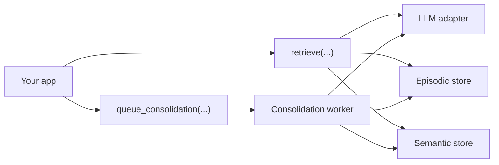

# GistLattice


GistLattice is a compact memory layer for agents and long-lived Python apps.

It gives you a clean way to:

- retrieve relevant episodic memories
- hydrate prompts with durable semantic context
- consolidate interactions back into memory
- swap storage backends without rewriting your app logic

It is intentionally core-first and Python-native. You can use it directly in an agent loop, wrap it in your own service, or grow it into a larger system later.

Tags: agent memory, LLM, prompt hydration, episodic memory, semantic memory, memory consolidation, Qdrant, Neo4j, Redis, OpenAI, Gemini, Ollama, Anthropic

## Why It Matters

Most agent stacks remember only the current prompt. GistLattice adds a structured memory loop:

1. look up relevant memories
2. inject context into the next prompt
3. analyze the interaction
4. write the result back into episodic and semantic memory

That gives your app a practical path from stateless chat to durable, tenant-aware memory.

## What You Get

- `retrieve(...)` for memory lookup
- `hydrate_context(...)` for prompt-ready memory text
- `build_hydrated_prompt(...)` for both the prompt block and structured gists
- `queue_consolidation(...)` for deferred memory writes
- `consolidate(...)` for turning a prompt/response pair into memory
- pluggable backends for episodic, semantic, and queue storage
- provider-agnostic LLM adapters, plus ready-made helpers for OpenAI, Gemini, Ollama, and Anthropic

## Install

Base install:

```bash
pip install gistlattice
```

Optional backend extras:

```bash
pip install gistlattice[qdrant]
pip install gistlattice[neo4j]
pip install gistlattice[redis]
```

Optional provider extras:

```bash
pip install gistlattice[openai]
pip install gistlattice[gemini]
pip install gistlattice[ollama]
pip install gistlattice[anthropic]
```

## Quick Start

You always need an LLM adapter. The default backends are in-memory, which makes the library easy to try locally.

```python
import asyncio

from gistlattice import Settings, build_default_service
from gistlattice.models import MemoryAnalysis


class DemoLLM:
    async def embed_text(self, text: str) -> list[float]:
        return [float(len(text))]

    async def analyze_interaction(self, *, prompt: str, response: str) -> MemoryAnalysis:
        return MemoryAnalysis(
            gist=f"Memory gist: {prompt[:60]}",
            valence=0.1,
            importance=0.5,
        )


def build_demo_llm(_settings: Settings) -> DemoLLM:
    return DemoLLM()


async def main() -> None:
    service = build_default_service(
        Settings(
            environment="test",
            llm_factory=build_demo_llm,
        )
    )

    retrieval = await service.retrieve(
        tenant_id="tenant-a",
        user_id="user-a",
        query="Help me plan my next task.",
    )
    print(retrieval.hydrated_context)

    job = await service.queue_consolidation(
        tenant_id="tenant-a",
        user_id="user-a",
        prompt="Help me plan my next task.",
        response="Here is a memory-bearing response from your own app.",
        request_id="req-123",
    )
    analysis = await service.consolidate(job.job_id)
    print(analysis.gist)


asyncio.run(main())
```

## Typical Flow



## Configuration

`Settings` can be created directly in Python or loaded from the environment.

Core settings:

- `GISTLATTICE_LLM_FACTORY_PATH` or `Settings.llm_factory` is required
- `GISTLATTICE_EPISODIC_BACKEND` defaults to `memory`
- `GISTLATTICE_SEMANTIC_BACKEND` defaults to `memory`
- `GISTLATTICE_QUEUE_BACKEND` defaults to `memory`
- `GISTLATTICE_MEMORY_LIMIT` defaults to `3`

Provider and backend docs:

- [Getting Started](./docs/getting-started.md)
- [Configuration](./docs/configuration.md)
- [Backends](./docs/backends.md)
- [Provider Adapters](./docs/providers.md)

If you use Qdrant, you can optionally set `GISTLATTICE_QDRANT_VECTOR_SIZE`. If you do not set it, GistLattice will create the collection from the first embedding it stores.

## Provider Helpers

GistLattice includes provider factories for common SDKs:

- `build_openai_llm(...)`
- `build_gemini_llm(...)`
- `build_ollama_llm(...)`
- `build_anthropic_llm(...)`

It also ships embedding-only helpers for workflows where the model used for memory analysis differs from the model used for embeddings.

## Examples

- [Deep Usage Walkthrough](./examples/deep_usage.py)
- [OpenAI-Backed Walkthrough](./examples/openai_usage.py)

Run the walkthroughs with:

```bash
python3 examples/deep_usage.py
python3 examples/openai_usage.py
```

## Testing

Run the test suite with:

```bash
python3 -m unittest discover -s tests -v
```

## Project Layout

- `gistlattice/` core library code
- `tests/` regression and unit tests
- `docs/` long-form documentation
- `examples/` runnable walkthroughs

## License

This project is licensed under the [Apache License 2.0](./LICENSE).
