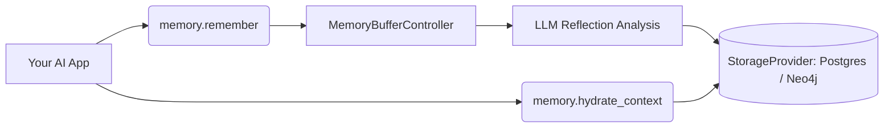

<div align="center">
  
[](./LICENSE)
[](https://www.python.org/downloads/)
[](#contributing)

**Cognitive Memory for AI Agents.**
<br>
A beautiful, three-method Python library for giving your LLMs durable, long-term memory.
</div>

---

## 🧠 Why GistLattice?

Most "Agent Memory" systems simply dump raw chat transcripts into a vector database. GistLattice is different. It uses an LLM to actively **reflect** on a conversation before saving it.

When you ask GistLattice to remember an interaction, it extracts:
1. **Gist**: A concise summary of the factual information.
2. **Valence**: The emotional tone (-1.0 to 1.0). Did the user get angry? Were they excited? Your agent will remember their mood!
3. **Importance**: A score (0.0 to 1.0) dictating how crucial this memory is. Passing comments decay quickly; major life events are cemented permanently.

## 📦 Installation

Install the base library (defaults to fast, in-memory databases):
```bash
pip install gistlattice
```

Install production backends (optional):
```bash
pip install gistlattice[postgres,neo4j,redis]
```

Install specific LLM providers:
```bash
pip install gistlattice[openai]
pip install gistlattice[gemini]
pip install gistlattice[anthropic]
pip install gistlattice[ollama]
```

## 🚀 Quick Start

The entire surface area of the library is encapsulated in a single, elegant class: `GistLattice`.

```python
from gistlattice import GistLattice

def main() -> None:
    # 1. Initialize the client (defaults to in-memory storage)
    memory = GistLattice(provider="openai", tenant_id="tenant-a", user_id="user-123")

    # 2. Store an interaction synchronously
    # This automatically buffers the interaction to eliminate per-turn LLM database mutations.
    memory.remember(
        prompt="I'm feeling really stressed about the product launch tomorrow.",
        response="I understand. Let's review the final checklist to make sure we are ready."
    )
    print("Memory buffered!")

    # 3. Retrieve formatted context to inject into your next LLM prompt
    context = memory.hydrate_context("What should I do next?")
    print("\n--- Hydrated Context ---")
    print(context)

if __name__ == "__main__":
    main()
```

> [!TIP]
> **For Best Performance:** `GistLattice` fully supports native `async/await`! If you are building a high-throughput API (like FastAPI), use `memory.aremember()`, `memory.aretrieve()`, and `memory.ahydrate_context()` to bypass background thread overhead.

## 📐 Architecture Flow

GistLattice intercepts conversations and routes them through a robust processing pipeline:



## 📚 Documentation

We have completely stripped out the architectural jargon. Our documentation is heavily focused on getting you building instantly:

1. **[How it Works (A Human Example)](./docs/how-it-works.md)**: A plain-English story demonstrating the difference between short-term buffers and GistLattice.
2. **[User Guide & API Reference](./docs/user-guide.md)**: Everything you need to know about `remember()`, `hydrate_context()`, and `retrieve()`.
3. **[Supported Providers](./docs/providers.md)**: How to switch between OpenAI, Gemini, Anthropic, and Ollama.
4. **[Production Backends](./docs/backends.md)**: How to connect to Redis, PostgreSQL, and Neo4j for durable, at-scale memory.

## 🛠 Examples

Want to see runnable code? Check out the `examples/` directory:
- [`01_basic_openai_sync.py`](./examples/01_basic_openai_sync.py)
- [`02_hybrid_gemini_async.py`](./examples/02_hybrid_gemini_async.py)
- [`production/01_programmatic.py`](./examples/production/01_programmatic.py)
- [`production/02_environment_variables.py`](./examples/production/02_environment_variables.py)

## 🤝 Contributing

We would love your help making GistLattice the standard for agent memory! To contribute:

1. Fork the repository.
2. Install dependencies: `pip install -e ".[dev,openai,postgres,neo4j,redis]"`
3. Run the test suite:
   ```bash
   python3 -m unittest discover -s tests -v
   ```
4. Submit a Pull Request!

## 📜 License

This project is licensed under the [Apache License 2.0](./LICENSE).
