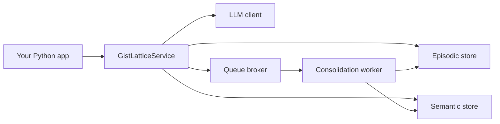

# Architecture

GistLattice is built around a single service layer. The library does not expose HTTP routes right now, and that is intentional.

## Main Components

- `GistLatticeService` contains the core memory operations.
- `GistLatticeContainer` holds the selected backends and runtime state.
- LLM clients embed text and analyze interactions.
- Episodic stores keep vectorized memory records.
- Semantic stores keep durable state edges.
- Queue brokers hold consolidation jobs until the worker processes them.

## Data Flow

## Core Request Flow

1. Your app calls `retrieve(...)` to inspect memory or `queue_consolidation(...)` to store a prompt/response pair from your own agent loop.
2. The service embeds the query using the configured LLM client.
3. The episodic store returns relevant memory gists.
4. The semantic store returns active state context.
5. The service builds a hydrated context string.
6. If you queue a consolidation job, the worker later consumes the queue and consolidates the interaction into long-term memory.

## Why This Shape

- The library stays usable from any Python app without a server process.
- The core logic is easy to test because everything is behind the service layer.
- Different backends can be swapped without changing the agent code.

## Related Docs

- [Getting Started](./getting-started.md)
- [Configuration](./configuration.md)
- [Backends](./backends.md)
